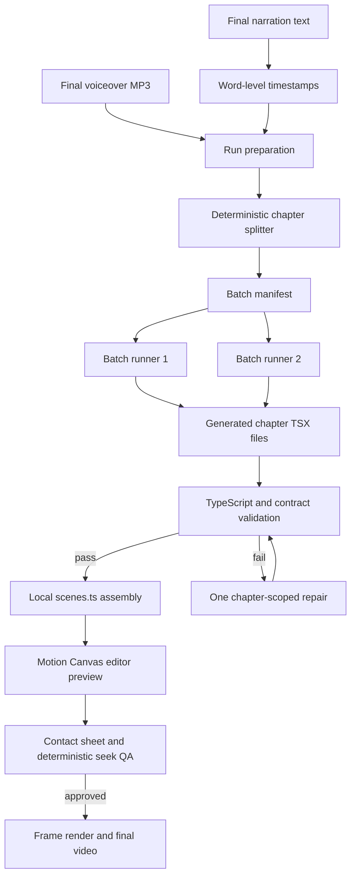

# MAV Studio Motion Canvas Scene Production Protocol

Status: integration specification derived from the working Physics Scene Generation Lab prototype  
Renderer: Motion Canvas 3.17.2  
Primary generation model in the prototype: Moonshot `kimi-k2.7-code`  
Target output: narrated, deterministic, programmatically rendered physics lessons

## 1. Purpose

This document defines how MAV Studio should produce physics animation scenes using the isolated Motion Canvas workflow proven in this repository.

The central design decision is:

> The narration and its word timestamps are the authority. The model writes small visual chapters; deterministic application code controls splitting, timing, assembly, caching, preview, validation, and rendering.

The model must not generate an entire multi-minute lesson in one response. A 249-second single-scene attempt reached 24,000 output tokens, was truncated, and produced no usable file. The successful workflow partitions the narration into independently generated chapters, groups a small number of chapters per paid request, and assembles the accepted files locally.

## 1.1 Code navigation map for an implementation agent

The links below point to the current implementation and the first relevant line. These are the minimum files an implementation agent should load before porting the workflow into MAV Studio.

| Production responsibility | Implementation reference |
|---|---|
| Runtime paths and two-minute defaults | [`motion_batch_robot.py:16`](motion_batch_robot.py#L16) |
| Convert absolute word timestamps into paragraph-local chapters | [`motion_batch_robot.py:39`](motion_batch_robot.py#L39) |
| Validate source audio/timestamps, create batches, copy preview audio, write manifest | [`motion_batch_robot.py:83`](motion_batch_robot.py#L83) |
| Construct the compact batch system/user prompt | [`motion_batch_robot.py:128`](motion_batch_robot.py#L128) |
| Enforce output markers and reject malformed/unsafe model responses | [`motion_batch_robot.py:153`](motion_batch_robot.py#L153) |
| Cache completed batches and call the configured coding model | [`motion_batch_robot.py:173`](motion_batch_robot.py#L173) |
| Assemble generated chapter imports into `scenes.ts` | [`motion_batch_robot.py:193`](motion_batch_robot.py#L193) |
| Run multiple batch calls concurrently and preserve partial success | [`motion_batch_robot.py:214`](motion_batch_robot.py#L214) |
| Root batch system prompt | [`motion_canvas_robot/prompts/batch.system.txt:1`](motion_canvas_robot/prompts/batch.system.txt#L1) |
| Approved Motion Canvas API, time-source, physics, and coordinate rules | [`motion_canvas_robot/src/robot/approved-api.md:1`](motion_canvas_robot/src/robot/approved-api.md#L1) |
| Neutral scene architecture reference | [`motion_canvas_robot/src/robot/scene-template.txt:1`](motion_canvas_robot/src/robot/scene-template.txt#L1) |
| Neutral analytic-physics reference | [`motion_canvas_robot/src/robot/physics-template.txt:1`](motion_canvas_robot/src/robot/physics-template.txt#L1) |
| Original single-scene system prompt | [`motion_canvas_robot/prompts/generate.system.txt:1`](motion_canvas_robot/prompts/generate.system.txt#L1) |
| Chapter repair system prompt | [`motion_canvas_robot/prompts/repair.system.txt:1`](motion_canvas_robot/prompts/repair.system.txt#L1) |
| Full single-scene timing-context and prompt construction | [`motion_robot.py:57`](motion_robot.py#L57), [`motion_robot.py:93`](motion_robot.py#L93) |
| Single-scene response parsing | [`motion_robot.py:137`](motion_robot.py#L137) |
| Local compile/preview validation orchestration | [`motion_robot.py:161`](motion_robot.py#L161), [`motion_robot.py:178`](motion_robot.py#L178) |
| Bounded single-scene generation and one repair attempt | [`motion_robot.py:208`](motion_robot.py#L208) |
| CLI provider/model environment routing | [`scene_lab.py:98`](scene_lab.py#L98) |
| CLI prepare-two-minute handler | [`scene_lab.py:254`](scene_lab.py#L254) |
| CLI concurrent generation handler | [`scene_lab.py:273`](scene_lab.py#L273) |
| CLI command declarations | [`scene_lab.py:394`](scene_lab.py#L394) |
| Model task/provider/token configuration | [`template_lab/prompts/prompt_model_mapping.json:130`](template_lab/prompts/prompt_model_mapping.json#L130) |
| Batch-specific Moonshot configuration | [`template_lab/prompts/prompt_model_mapping.json:158`](template_lab/prompts/prompt_model_mapping.json#L158) |
| Environment/config token-limit resolution | [`template_lab/scripts/mav_models.py:150`](template_lab/scripts/mav_models.py#L150) |
| Environment/config timeout resolution | [`template_lab/scripts/mav_models.py:176`](template_lab/scripts/mav_models.py#L176) |
| Provider-independent text-model dispatch | [`template_lab/scripts/mav_models.py:270`](template_lab/scripts/mav_models.py#L270) |
| Moonshot request construction | [`template_lab/scripts/mav_models.py:562`](template_lab/scripts/mav_models.py#L562) |
| Reject truncated Moonshot responses | [`template_lab/scripts/mav_models.py:638`](template_lab/scripts/mav_models.py#L638) |
| Thread-safe cost summarization and recording | [`template_lab/scripts/mav_costs.py:117`](template_lab/scripts/mav_costs.py#L117), [`template_lab/scripts/mav_costs.py:190`](template_lab/scripts/mav_costs.py#L190) |
| Fixed Motion Canvas project and voiceover attachment | [`motion_canvas_robot/src/project.ts:1`](motion_canvas_robot/src/project.ts#L1) |
| Current deterministic chapter assembly example | [`motion_canvas_robot/src/generated/scenes.ts:1`](motion_canvas_robot/src/generated/scenes.ts#L1) |
| Current generated chapter examples | [`motion_canvas_robot/src/generated/chapters/chapter_01.tsx:1`](motion_canvas_robot/src/generated/chapters/chapter_01.tsx#L1), [`chapter_03.tsx:1`](motion_canvas_robot/src/generated/chapters/chapter_03.tsx#L1) |
| Browser-side Motion Canvas initialization and deterministic seeking | [`motion_canvas_robot/src/render-host.ts:1`](motion_canvas_robot/src/render-host.ts#L1), [`motion_canvas_robot/src/render-host.ts:36`](motion_canvas_robot/src/render-host.ts#L36) |
| Five-frame preview, deterministic comparison, contact sheet, and FFmpeg export | [`motion_canvas_robot/scripts/render.mjs:13`](motion_canvas_robot/scripts/render.mjs#L13), [`motion_canvas_robot/scripts/render.mjs:79`](motion_canvas_robot/scripts/render.mjs#L79) |
| Exact Node package versions and workflow commands | [`motion_canvas_robot/package.json:1`](motion_canvas_robot/package.json#L1) |
| Motion Canvas Vite entry configuration | [`motion_canvas_robot/vite.config.ts:1`](motion_canvas_robot/vite.config.ts#L1) |
| Strict TypeScript and Motion Canvas JSX configuration | [`motion_canvas_robot/tsconfig.json:1`](motion_canvas_robot/tsconfig.json#L1) |

Load the prompt files and `motion_batch_robot.py` before reading generated scenes. The generated chapters are examples of model output, while the prompt/runtime files define the reusable production behavior.

## 2. Production flow



MAV Studio should implement each box as an explicit, inspectable stage. Paid model calls occur only in batch generation and optional chapter repair.

## 3. Inputs supplied by the physics pipeline

Every scene-production run requires:

1. Final voiceover audio.
2. Word-level timestamps created from that exact audio.
3. Stable paragraph or narration-beat identifiers.
4. Lesson metadata such as topic, audience, resolution, and target frame rate.
5. Optional verified physics grounding prepared upstream.

### 3.1 Word timestamp contract

The prototype consumes this structure:

```json
{
  "audio_duration_seconds": 249.144,
  "source": "openai_whisper_word_timestamps",
  "words": [
    {
      "index": 0,
      "paragraph_id": "paragraph_01",
      "word": "imagine",
      "start": 0.0,
      "end": 0.7,
      "duration": 0.7
    }
  ]
}
```

Requirements:

- Times are seconds relative to the beginning of the final audio.
- Words are ordered by `start`.
- Every word belongs to a stable paragraph or beat.
- The audio must not be changed after timestamps are produced.
- The final word end must not exceed the audio duration.
- Non-speech pauses remain represented by gaps between timestamps.

## 4. Deterministic chapter segmentation

Chapter splitting is application logic, not an LLM task.

The prototype groups words by `paragraph_id`. A chapter begins at the first word of its paragraph and ends at the first word of the next paragraph. The first chapter starts at zero so introductory silence is retained. The final chapter ends at the selected preview cutoff or full audio duration.

For each chapter, convert absolute word times into chapter-local times:

```text
local_start = absolute_word_start - chapter_absolute_start
local_end   = absolute_word_end   - chapter_absolute_start
```

Chapter manifest entry:

```json
{
  "id": "paragraph_03",
  "scene_id": "chapter_03",
  "absolute_start": 54.96,
  "absolute_end": 84.62,
  "duration": 29.66,
  "narration": "look at a distance time graph ...",
  "words": [
    {"word": "look", "start": 0.0, "end": 0.68}
  ]
}
```

The duration identity must hold:

```text
chapter.duration = chapter.absolute_end - chapter.absolute_start
sum(chapter.duration) = selected lesson duration
```

## 5. Cost-controlled batching

Do not send the complete lesson, all timestamps, and all scene source code to every request.

The working strategy is:

- One or two related chapters per request.
- Only the exact word records belonging to those chapters.
- A compact shared system contract.
- A short approved-API guide.
- Fixed theme and coordinate rules.
- No previously generated chapter source.

Across all requests, every timestamp is supplied exactly once.

Recommended defaults:

```text
batch_size: 2 chapters
concurrent_workers: 2
maximum_workers: 4
max_output_tokens: 25,000
timeout_seconds: 3,600
```

Use two workers initially. Four workers may be used only when provider rate limits and budget controls are known.

### 5.1 Cache behavior

Each batch writes:

```text
runs/<run-id>/prompts/batch_NN.txt
runs/<run-id>/responses/batch_NN.txt
generated/chapters/chapter_NN.tsx
```

A batch is cached only when:

- Its response exists.
- Every expected chapter file exists.
- Its input hash still matches the manifest, prompt version, model, and renderer version.

Rerunning a partial job must call the model only for missing or invalid batches.

## 6. Model responsibility

The model writes one complete Motion Canvas TSX file per requested chapter.

It does not control:

- Project configuration.
- Package installation.
- Voiceover loading.
- Chapter boundaries.
- Absolute timeline assembly.
- Browser automation.
- Validation policy.
- Video encoding.
- Cost ledger writes.

Output format:

```text
=== chapter_03.tsx ===
[complete TSX]
=== chapter_04.tsx ===
[complete TSX]
```

Markdown fences and explanatory prose are rejected.

## 6.1 Prompt-engineering strategy used in the working system

The result quality came from narrowing and repeating the important constraints, not from a single broad request such as “make a physics animation.” The current prompt is composed in [`motion_batch_robot.py:128`](motion_batch_robot.py#L128) from the root contract in [`batch.system.txt:1`](motion_canvas_robot/prompts/batch.system.txt#L1) and the approved API in [`approved-api.md:1`](motion_canvas_robot/src/robot/approved-api.md#L1).

### Technique 1: Separate permanent rules from run-specific context

The system message contains rules that apply to every physics chapter:

- Required file structure.
- One-clock architecture.
- Physics determinism.
- Centered Motion Canvas coordinates.
- Safe area.
- Forbidden APIs and dependencies.
- Compactness and line limits.

See [`batch.system.txt:1`](motion_canvas_robot/prompts/batch.system.txt#L1).

The user message contains only batch-specific information:

- Exact output markers.
- Fixed palette and resolution.
- Approved API reference.
- One or two chapter records.
- Exact local word timestamps.

See the construction at [`motion_batch_robot.py:133`](motion_batch_robot.py#L133).

This keeps prompts small and makes permanent constraints easy to version.

### Technique 2: Make narration the explicit source of truth

The model is told that narration and timestamps are the sole content and timing authority. It cannot invent narration, change claims, reorder examples, or choose a different lesson structure.

The full single-scene prototype makes this policy explicit at [`motion_robot.py:115`](motion_robot.py#L115). Batch prompts enforce the same behavior through [`batch.system.txt:8`](motion_canvas_robot/prompts/batch.system.txt#L8) and the chapter JSON added at [`motion_batch_robot.py:143`](motion_batch_robot.py#L143).

### Technique 3: Supply local timestamps, not the whole lesson repeatedly

The deterministic splitter converts global timestamps into local chapter times at [`motion_batch_robot.py:61`](motion_batch_robot.py#L61). Each batch receives only the words for its one or two chapters.

This preserves every timestamp while preventing the full 22,000-token lesson context from being repeated in each paid request.

### Technique 4: Use exact output markers as a lightweight code protocol

The prompt tells the model exactly which files to return:

```text
=== chapter_03.tsx ===
[complete file]
=== chapter_04.tsx ===
[complete file]
```

Markers are created at [`motion_batch_robot.py:133`](motion_batch_robot.py#L133) and strictly parsed at [`motion_batch_robot.py:153`](motion_batch_robot.py#L153). The parser rejects missing, duplicated, out-of-order, empty, fenced, or externally imported output.

This was more reliable and cheaper than asking the model to describe changes or return a complete project.

### Technique 5: Give architecture, not a large content example

A large projectile example initially biased the model toward projectile content even when the voiceover discussed a different topic. The production prompt should provide neutral architecture through:

- [`scene-template.txt:1`](motion_canvas_robot/src/robot/scene-template.txt#L1)
- [`physics-template.txt:1`](motion_canvas_robot/src/robot/physics-template.txt#L1)

The template demonstrates one time signal and a pure state function without suggesting lesson content.

### Technique 6: Repeat high-risk constraints in both prompt layers

The coordinate failure happened because “1920×1080” was interpreted as browser coordinates. The fix repeats the centered coordinate contract in:

- Root system rules: [`batch.system.txt:12`](motion_canvas_robot/prompts/batch.system.txt#L12)
- Approved API: [`approved-api.md:18`](motion_canvas_robot/src/robot/approved-api.md#L18)
- Per-batch user prompt: [`motion_batch_robot.py:137`](motion_batch_robot.py#L137)

High-risk constraints should be repeated in system and user messages:

```text
Origin: (0,0) at canvas center
Visible: x=-960..960, y=-540..540
Safe: x=-860..860, y=-440..440
```

This intentional repetition is useful because layout errors invalidate the whole scene.

### Technique 7: State forbidden approaches explicitly

The prompt does not merely request “correct physics.” It forbids known failure modes:

- No `Math.random()`.
- No variable browser delta-time integration.
- No path-length progress as physical time.
- No independent animation of related quantities.
- No external URLs or new dependencies.
- No top-left browser coordinates.

See [`batch.system.txt:10`](motion_canvas_robot/prompts/batch.system.txt#L10) and [`approved-api.md:11`](motion_canvas_robot/src/robot/approved-api.md#L11).

Negative constraints are most effective when paired with the approved replacement: one progress signal, `localTime()`, pure `stateAt(t)`, and centered coordinates.

### Technique 8: Constrain response size before increasing token limits

The system requests fewer than approximately 400 lines per chapter and favors reactive expressions over repeated drawing code. See [`batch.system.txt:18`](motion_canvas_robot/prompts/batch.system.txt#L18).

The configured 25,000-token ceiling is visible in [`prompt_model_mapping.json:164`](template_lab/prompts/prompt_model_mapping.json#L164) and at the call site [`motion_batch_robot.py:183`](motion_batch_robot.py#L183). Environment overrides are resolved by [`mav_models.py:150`](template_lab/scripts/mav_models.py#L150).

If a two-chapter response still reaches the limit, split that batch into one chapter per call. Do not continue increasing the output ceiling indefinitely.

### Technique 9: Preserve successful work and repair at the smallest scope

The generator checks for existing response and chapter files before a paid call at [`motion_batch_robot.py:173`](motion_batch_robot.py#L173). Concurrent results and failures are recorded independently at [`motion_batch_robot.py:214`](motion_batch_robot.py#L214).

This prevents a broken chapter from causing regeneration of accepted scenes. The repair prompt is defined at [`repair.system.txt:1`](motion_canvas_robot/prompts/repair.system.txt#L1); production integration should pass only the failed chapter plus concrete diagnostics.

### Technique 10: Ask for semantic visuals, not decorative motion

Prompt language should name the teaching relationship:

```text
Show the same canonical state driving the object, vector, number, and graph cursor.
Reveal the geometric relationship before the equation.
Keep one active teaching focus at a time.
```

Avoid subjective requests such as “make it cinematic” unless they are translated into measurable rules—hierarchy, spacing, opacity, safe area, font size, and timing.

### Recommended production prompt composition

```text
SYSTEM
  Role and exact output contract
  Single-clock and physics rules
  Coordinate/safe-area rules
  Forbidden approaches
  Compactness limits

USER
  Exact requested file markers
  Fixed theme and typography tokens
  Approved Motion Canvas API
  Chapter duration and local word timestamps
  Narration text
  Scene-family-specific constraints, if any
```

Do not include unrelated modules, entire documentation sites, previous chapter source, or the full lesson timestamp payload in every batch.

## 7. Required Motion Canvas scene architecture

Every chapter is an independent `makeScene2D` default export.

```tsx
import {Circle, Line, Rect, Txt, makeScene2D} from '@motion-canvas/2d';
import {createSignal, linear} from '@motion-canvas/core';

const CHAPTER_DURATION = 29.66;

export default makeScene2D(function* (view) {
  const progress = createSignal(0);
  const localTime = () => progress() * CHAPTER_DURATION;

  // Every physical and visual value derives from localTime().

  yield* progress(1, CHAPTER_DURATION, linear);
});
```

### 7.1 One clock

Every chapter has exactly one master progress signal.

The object, vector, graph cursor, numerical value, equation substitution, highlight, and reveal timing must derive from the same local time.

Never independently tween related physical quantities.

### 7.2 Physics state

Physics should be expressed as pure functions:

```ts
function stateAt(t: number) {
  return {
    position: initialPosition + initialVelocity * t + 0.5 * acceleration * t * t,
    velocity: initialVelocity + acceleration * t,
    acceleration,
  };
}
```

Visuals bind to the returned state. A path is a visualization of sampled state; it must not drive time-based motion by path length.

Use analytic models for:

- Constant speed and acceleration.
- Projectile motion without drag.
- Uniform circular motion.
- Simple harmonic motion.
- Elementary wave profiles.
- Graph-based kinematics.

Use a rigid-body engine only for genuine contact, collision, friction, joints, or constraints. The first MAV Studio integration should not require Rapier for analytic lessons.

## 8. Coordinate system contract

This rule is mandatory because it caused the principal layout defect in the prototype.

Motion Canvas uses centered coordinates:

```text
Canvas center: (0, 0)
Visible x: -960 to 960
Visible y: -540 to 540
Safe x: -860 to 860
Safe y: -440 to 440
```

Do not use browser coordinates such as:

```text
x = 1200
y = 800
canvas center = (960, 540)
```

If a design begins in top-left coordinates:

```text
motionX = browserX - 960
motionY = browserY - 540
```

A full-screen background remains centered:

```tsx
<Rect width={1920} height={1080} />
```

Safe-area validation must consider element size and animated extrema, not only anchor positions.

## 9. Visual design contract

The current prototype palette is:

```ts
const theme = {
  background: '#07111f',
  panel: '#0e1d31',
  text: '#eaf3ff',
  muted: '#91a8c5',
  primary: '#46d9ff',
  emphasis: '#ffc857',
  warning: '#ff6b6b',
};
```

Color represents meaning, not decoration. For example, once velocity is cyan, it remains cyan throughout the lesson.

Visual hierarchy:

- Primary teaching object: opacity 1.0.
- Supporting context: opacity approximately 0.4.
- Structural grids and axes: opacity approximately 0.15.
- No more than five or six important elements visible simultaneously.
- Preserve at least 15% intentional empty space.
- Show geometry or physical intuition before displaying the equation.

Suggested type scale at 1920×1080:

```text
Scene title: 48–56 px
Section heading: 38–44 px
Equation/result: 38–52 px
Body/explanation: 30–36 px
Graph label: 26–32 px
Minimum important text: 30 px for phone-view readability
```

Fonts and mathematical rendering should be fixed by the MAV Studio design system, not chosen by each model response. The renderer should load local font files so preview and production use identical metrics.

## 10. Narration synchronization

The visual should appear slightly before or as its associated phrase begins. It must never appear meaningfully after the narration has already explained it.

The prompt receives local word timestamps so it can schedule semantic reveals. It should not create one visual per word.

Recommended beat extraction:

1. Identify nouns representing new objects or diagrams.
2. Identify equation or definition phrases.
3. Identify comparison, question, pause, and conclusion phrases.
4. Reveal the visual approximately 0.1–0.3 seconds before the key phrase when possible.
5. Hold the completed visual during explanatory pauses.

The final generator line guarantees exact chapter duration:

```tsx
yield* progress(1, CHAPTER_DURATION, linear);
```

## 11. Scene families MAV Studio must support

The same chapter contract can produce different visual families. The planner should classify each narration beat before invoking the chapter coder.

| Scene family | Typical use | Correct state source |
|---|---|---|
| Physical motion | Linear, projectile, circular, orbital, SHM | Analytic `stateAt(t)` |
| Graph | Distance-time, velocity-time, force-extension | Solver samples and shared time |
| Vector diagram | Velocity, force, field, momentum | Canonical vector state |
| Equation derivation | Definitions, rearrangement, substitution | Verified symbolic steps |
| Numerical example | Given values to final answer | Unit-aware calculation |
| Force/free-body diagram | Balanced/unbalanced forces | Vector sum computed from arrows |
| Energy visualization | Kinetic, potential, thermal transfer | Computed energy values |
| Wave visualization | Transverse, longitudinal, standing waves | Analytic wave model |
| Ray diagram | Reflection, refraction, lenses | Deterministic geometry |
| Circuit diagram | Current, voltage, resistance | Circuit/network state |
| Particle model | Gas, atoms, radiation | Seeded deterministic particles |
| Comparison/table | Cases, states, definitions | Static verified content |
| Lifecycle/process | Nuclear reaction, star lifecycle | Ordered semantic stages |
| Summary card | Retrieval practice and conclusion | Narration claims only |

Specialized prompt fragments may add rules for a family, but the common clock, centered coordinates, safe area, duration, and output format never change.

## 12. Assembly

Assembly is deterministic local code.

```ts
import chapter01 from './chapters/chapter_01?scene';
import chapter02 from './chapters/chapter_02?scene';

export const scenes = [chapter01, chapter02];
```

Project configuration is fixed:

```ts
import {makeProject} from '@motion-canvas/core';
import {scenes} from './generated/scenes';

export default makeProject({
  scenes,
  audio: '/voiceover.mp3',
});
```

The LLM must never write `project.ts` or `scenes.ts`.

## 13. Validation gates

MAV Studio should distinguish generation from approval.

### 13.1 Static gate

- Expected output markers exist exactly once.
- No Markdown fences.
- Only approved imports.
- No external URLs.
- No `Math.random()`.
- One `progress` clock.
- Exact `CHAPTER_DURATION`.
- Final generator uses the exact chapter duration.
- Centered coordinate contract is respected.
- TypeScript compilation passes.

### 13.2 Physics gate

- No `NaN` or infinite samples.
- Units are dimensionally consistent.
- Model-specific invariants pass.
- Graph and physical object use the same state and time.
- Force resultants are computed rather than supplied independently.
- Projectile positions use physical time, not uniform path progress.

### 13.3 Visual gate

Capture chapter start, midpoint, and end.

- No blank frames.
- Important content remains within the safe area.
- Minimum text size is respected.
- No major text overlaps.
- Primary content has sufficient contrast.
- Repeated midpoint seek produces an identical frame.
- The scene visibly changes when narration describes change.

### 13.4 Audio gate

- Voiceover loads locally.
- Scene duration sum matches audio duration within one frame.
- Chapter boundaries align with timestamp boundaries.
- No unintended gap or overlap is inserted during assembly.

## 14. Repair policy

Repairs operate on one failed chapter, not the whole batch or lesson.

The repair model receives:

- Original chapter data.
- Current chapter source.
- Compiler diagnostics.
- Failed physics assertions.
- Measured overflow/overlap evidence.
- Relevant preview frame paths.

Allow one automatic repair attempt. If it still fails, retain the last known-good chapters, mark the run partial, and require review.

Do not ask a repair model to change lesson timing or scientific claims.

## 15. Failure lessons from the prototype

### Single-response truncation

A complete 249-second scene request used 22,831 input tokens and reached the 24,000 output-token ceiling. The response was correctly rejected.

Action: use chapter batching.

### Batch truncation

A two-chapter batch reached the original 16,000-token ceiling.

Action: use a 25,000-token ceiling and require compact files below approximately 400 lines. If a batch still reaches the ceiling, retry its chapters individually rather than increasing the limit indefinitely.

### Wrong coordinate origin

Two generated chapters used browser-style positions such as `x=1200` and `y=800`, placing content off-screen.

Action: repeat centered coordinate ranges in both system and user prompts, then validate numeric and derived bounds.

### Repeated paid work

Failed global and batch attempts increased experimental cost.

Action: cache successful batches, preserve generated source, retry only missing chapters, and record every provider response ID and token count.

## 16. Cost accounting

The prototype records every model call with:

```json
{
  "task": "motion_canvas_batch",
  "provider": "moonshot",
  "model": "kimi-k2.7-code",
  "input_tokens": 3096,
  "cached_input_tokens": 3096,
  "output_tokens": 13488,
  "estimated_cost_usd": 0.05454
}
```

For the successful two-minute scene set:

```text
Successful calls: 3
Input tokens: 7,312
Output tokens: 35,819
Estimated usable generation cost: $0.147870
```

The total experiment, including failed/truncated calls, cost an estimated `$0.399425`. Production reporting must separate usable-generation cost from failure/retry cost.

## 17. Recommended MAV Studio run structure

```text
runs/<run-id>/
├── input.json
├── narration.json
├── voiceover.mp3
├── audio_word_timestamps.json
├── motion_canvas/
│   ├── manifest.json
│   ├── prompts/
│   ├── responses/
│   ├── chapters/
│   ├── scenes.ts
│   ├── validation/
│   ├── preview/
│   └── generation-report.json
└── costs/
    ├── model_usage.json
    └── summary.json
```

Every artifact should be content-addressed or versioned with:

- Run ID.
- Input hash.
- Audio hash.
- Timestamp hash.
- Prompt version.
- Motion Canvas version.
- Model/provider name.
- Source hash per chapter.
- Validation status.
- Repair count.

## 18. Integration sequence

MAV Studio should integrate this workflow in this order:

1. Accept finalized voiceover and word timestamps.
2. Produce a deterministic chapter manifest.
3. Create cost-bounded batches.
4. Generate batches concurrently with a low worker count.
5. Parse and save individual chapter files.
6. Type-check each chapter against the fixed project.
7. Repair only failed chapters.
8. Assemble accepted chapters locally.
9. Open the Motion Canvas preview with the original audio.
10. Capture three frames per chapter and run visual/physics gates.
11. Require approval before high-quality rendering.
12. Render frames, encode video, and mux the original narration.

## 19. Reference implementation in this repository

| Responsibility | File and starting line |
|---|---|
| Two-minute timestamp splitting and concurrent batching | [`motion_batch_robot.py:39`](motion_batch_robot.py#L39) |
| Single-scene prototype and local validation | [`motion_robot.py:57`](motion_robot.py#L57) |
| CLI integration | [`scene_lab.py:201`](scene_lab.py#L201) |
| Batch system prompt | [`motion_canvas_robot/prompts/batch.system.txt:1`](motion_canvas_robot/prompts/batch.system.txt#L1) |
| Single-scene generation prompt | [`motion_canvas_robot/prompts/generate.system.txt:1`](motion_canvas_robot/prompts/generate.system.txt#L1) |
| Chapter repair prompt | [`motion_canvas_robot/prompts/repair.system.txt:1`](motion_canvas_robot/prompts/repair.system.txt#L1) |
| Approved Motion Canvas API and coordinate contract | [`motion_canvas_robot/src/robot/approved-api.md:1`](motion_canvas_robot/src/robot/approved-api.md#L1) |
| Neutral scene template | [`motion_canvas_robot/src/robot/scene-template.txt:1`](motion_canvas_robot/src/robot/scene-template.txt#L1) |
| Neutral physics template | [`motion_canvas_robot/src/robot/physics-template.txt:1`](motion_canvas_robot/src/robot/physics-template.txt#L1) |
| Model/provider/token task mapping | [`template_lab/prompts/prompt_model_mapping.json:130`](template_lab/prompts/prompt_model_mapping.json#L130) |
| Model provider dispatch and truncation rejection | [`template_lab/scripts/mav_models.py:270`](template_lab/scripts/mav_models.py#L270) |
| Thread-safe model cost recording | [`template_lab/scripts/mav_costs.py:190`](template_lab/scripts/mav_costs.py#L190) |
| Fixed Motion Canvas project | [`motion_canvas_robot/src/project.ts:1`](motion_canvas_robot/src/project.ts#L1) |
| Deterministic generated scene assembly | [`motion_canvas_robot/src/generated/scenes.ts:1`](motion_canvas_robot/src/generated/scenes.ts#L1) |
| Browser seek host | [`motion_canvas_robot/src/render-host.ts:36`](motion_canvas_robot/src/render-host.ts#L36) |
| Browser frame renderer | [`motion_canvas_robot/scripts/render.mjs:79`](motion_canvas_robot/scripts/render.mjs#L79) |
| Dependency versions and scripts | [`motion_canvas_robot/package.json:1`](motion_canvas_robot/package.json#L1) |
| Current timestamp-derived manifest | [`motion_canvas_robot/runs/two_minute/manifest.json:1`](motion_canvas_robot/runs/two_minute/manifest.json#L1) |
| Current chapter examples | [`chapter_01.tsx:1`](motion_canvas_robot/src/generated/chapters/chapter_01.tsx#L1), [`chapter_03.tsx:1`](motion_canvas_robot/src/generated/chapters/chapter_03.tsx#L1), [`chapter_05.tsx:1`](motion_canvas_robot/src/generated/chapters/chapter_05.tsx#L1) |

## 20. Production acceptance criteria

The MAV Studio integration is ready when a run can demonstrate all of the following without manual source intervention:

- The audio and timestamp hashes match the approved narration.
- The complete lesson is split into deterministic chapters.
- Paid generation can resume after partial failure.
- No successful batch is regenerated unnecessarily.
- All chapter files compile.
- All scene durations sum to the audio duration within one frame.
- Physical objects, vectors, graphs, and numbers stay synchronized.
- Important content stays inside centered Motion Canvas safe bounds.
- Preview seeking is deterministic.
- Cost reporting distinguishes successful and failed calls.
- The approved source, prompt, validation evidence, and final render are reproducible from the run directory.

This protocol keeps the system intentionally small: narration-driven chapter generation, a fixed Motion Canvas runtime, deterministic local assembly, and evidence-based validation. More specialized solvers or visual modules should be added only when a demonstrated physics family requires them.
