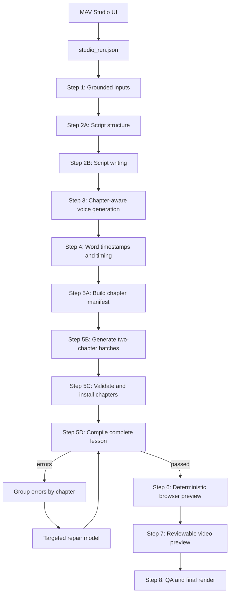
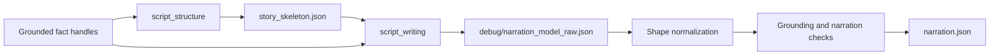
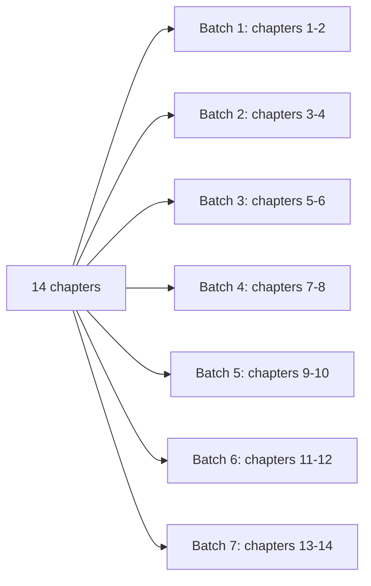
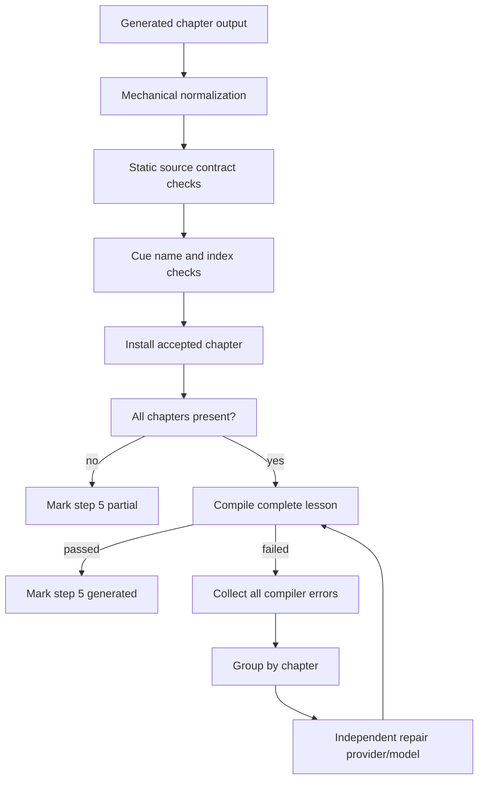

# MAV Physics Studio — Motion Canvas and Codex Handoff

## 1. Purpose

This document hands the active MAV Physics Studio production workflow to another coding agent.

The production path is:

> grounded syllabus facts → structured lesson script → chapter audio → word timestamps → narration-aligned Motion Canvas chapters → aggregate compilation and repair → deterministic video preview → final render

The retained workflow is narration-authoritative. The generated animation must follow the existing voiceover and chapter-local word cues. Do not redesign this as a visual-first pipeline, a free-running scene timeline, Direct HTML, Remotion, or a legacy scene-recipe workflow.

The current acceptance run is:

```text
template_lab/runs/physics-1-4-v01
```

Current state:

- Topic: `1.4 Density`
- Studio step: completed through step 7
- Script structure: Codex `gpt-5.6-sol`, low reasoning
- Script writing: Codex `gpt-5.6-sol`, medium reasoning
- Voice: Gemini TTS
- Motion Canvas chapter generation: Codex `gpt-5.6-sol`, low reasoning
- Motion Canvas repair: Codex `gpt-5.6-sol`, low reasoning
- Generated chapters: complete
- TypeScript compilation: passed
- Preview duration: `543.2333` seconds
- Deterministic preview: passed
- Browser console errors: none
- Browser page errors: none

Run artifacts are intentionally ignored by Git and should not be committed.

---

## 2. Production flow



The main command-line orchestrator is:

```text
template_lab/scripts/mav_generate.py
```

The UI constructs and launches that command from:

```text
studio/server.py
```

The browser UI is:

```text
studio/static/app.js
```

---

## 3. UI and model routing

### New-run controls

The production form lets the user select:

- Script generator/model
- Script reasoning effort
- Voice provider
- Chapter generator
- Chapter Codex model
- Chapter reasoning effort
- Chapter concurrency

Codex script models appear directly in the script selector:

- `gpt-5.6-sol`
- `gpt-5.6-terra`
- `gpt-5.6-luna`
- `gpt-5.5`
- `gpt-5.4`
- `gpt-5.4-mini`

Supported Codex reasoning values:

- `low`
- `medium`
- `high`
- `xhigh`
- `max`
- `ultra`

### Existing-run controls

The active run contains a model map with independent routing for:

- `script_structure`
- `script_writing`
- `audio_generation`
- `motion_canvas_batch`
- `motion_canvas_repair`

The user can change provider, model, and Codex reasoning in the middle of a run. The UI must capture the visible selections before resetting a step. This ordering is important: an earlier bug reset and re-rendered the run before reading the new model selections, silently restoring Kimi.

Relevant functions:

```text
studio/static/app.js
  modelMapMarkup()
  collectTaskModels()
  productionPayload()

studio/server.py
  model_map_payload()
  _validate_task_models()
  update_run_models()
  build_generation_command()
```

`build_generation_command()` translates saved model selections into task-specific environment variables:

```text
MAV_SCRIPT_STRUCTURE_PROVIDER
MAV_SCRIPT_STRUCTURE_MODEL
MAV_SCRIPT_STRUCTURE_REASONING_EFFORT

MAV_SCRIPT_WRITING_PROVIDER
MAV_SCRIPT_WRITING_MODEL
MAV_SCRIPT_WRITING_REASONING_EFFORT

MAV_MOTION_CANVAS_BATCH_PROVIDER
MAV_MOTION_CANVAS_BATCH_MODEL
MAV_MOTION_CANVAS_BATCH_REASONING_EFFORT

MAV_MOTION_CANVAS_REPAIR_PROVIDER
MAV_MOTION_CANVAS_REPAIR_MODEL
MAV_MOTION_CANVAS_REPAIR_REASONING_EFFORT
```

Model definitions and task defaults live in:

```text
template_lab/prompts/prompt_model_mapping.json
```

---

## 4. How Codex CLI is invoked

The reusable adapter is:

```text
template_lab/scripts/mav_codex.py
```

Codex is run through the user's ChatGPT-authenticated CLI, not an OpenAI API key.

The adapter:

1. Finds the Codex binary.
2. Verifies `codex login status`.
3. Builds a bounded prompt.
4. Runs `codex exec` ephemerally.
5. Uses a read-only sandbox.
6. Selects the requested model.
7. passes `model_reasoning_effort` explicitly.
8. Optionally passes a strict output JSON Schema.
9. Reads the final response from a temporary file.
10. Records token usage in the normal run cost ledger.

Codex binary discovery checks:

- `MAV_CODEX_BIN`
- normal executable `PATH`
- VS Code extension installations under `~/.vscode/extensions/openai.chatgpt-*`
- VS Code Insiders extension installations

Typical installed binary:

```text
/Users/ananthu/.vscode/extensions/openai.chatgpt-*/bin/macos-aarch64/codex
```

The CLI does not expose the exact remaining ChatGPT/Codex subscription allowance. The pipeline records tokens used but must not invent a remaining quota value.

### Structured output

Codex structured output requires every JSON object schema to include:

```json
{
  "additionalProperties": false
}
```

`mav_codex.py` applies this recursively through `_strict_output_schema()`.

Do not remove this normalization. Without it, script generation fails before the model runs with `invalid_json_schema`.

---

## 5. Script generation

Step 2 has two distinct model calls.



Implementation:

```text
template_lab/scripts/mav_script.py
```

Primary outputs:

```text
story_skeleton.json
narration.json
narration.txt
narration_elevenlabs.txt
debug/narration_model_raw.json
debug/narration_normalized.json
debug/narration_validation.json
debug/script_generation_debug.json
```

`script_structure` creates the teaching sequence. `script_writing` expands it into narration paragraphs while preserving grounded claim IDs.

The script and scene generators are provider-independent through:

```text
template_lab/scripts/mav_models.py
```

`mav_models.py` supports API-backed providers and the subscription-backed `codex` provider.

---

## 6. Audio and timing

Voice generation occurs before animation generation. The animation never decides the lesson duration independently.

The audio path produces:

```text
voiceover.mp3
audio_generation.json
audio_timing.json
audio_word_timestamps.json
```

The pipeline uses chapter-aware audio generation. Word timing becomes the authoritative timing source for scene reveals.

The important rule is:

> Do not offset animation with guessed timing, equal-duration subdivisions, or arbitrary pauses. Use the supplied chapter-local cue values.

---

## 7. How Motion Canvas scenes are generated

The main implementation is:

```text
template_lab/motion_canvas/pipeline.py
```

### 7.1 Preparing the manifest

`prepare()` reads:

- `voiceover.mp3`
- `audio_word_timestamps.json`
- narration paragraphs

It divides the lesson into narration-aligned chapters and writes:

```text
motion_canvas/manifest.json
motion_canvas/voiceover.mp3
motion_canvas/chapters/chapter_NN.cues.ts
motion_canvas/prompts/batch_NN.txt
```

Each manifest chapter contains:

- chapter/scene ID
- narration excerpt
- absolute start/end
- local duration
- chapter-local word timestamps

### 7.2 Cue generation

`_write_chapter_cues()` produces one deterministic TypeScript cue module per chapter:

```ts
export const CUES = {
  density: [1.24, 8.52],
  mass: [3.18],
  "148": [12.72],
  let_s: [0.0],
} as const;
```

Cue names are normalized:

- punctuation may become underscores
- `"let's"` becomes `let_s`
- numeric words remain string keys and require bracket access

Valid access examples:

```ts
CUES.density[0]
CUES.let_s[0]
CUES["148"][0]
```

Invalid examples:

```ts
CUES.lets[0]
CUES.148[0]
CUES.moon[1] // invalid if moon occurs only once
```

### 7.3 Batching

The default batch size is two chapters.



Concurrency is capped at two workers in Studio.

This protects:

- provider concurrency limits
- subscription usage
- deterministic cache handling
- targeted repair capacity

### 7.4 Prompt construction

`_batch_prompt()` combines:

- output markers
- visual theme
- approved Motion Canvas API
- presentation-component contract
- centered coordinate system
- safe-area rules
- chapter narration
- local word timestamps
- exact duration

Prompt files:

```text
template_lab/motion_canvas/prompts/batch.system.txt
template_lab/motion_canvas/prompts/approved-api.md
template_lab/motion_canvas/prompts/repair.system.txt
```

The model must return:

```text
=== chapter_01.tsx ===
<complete TSX source>

=== chapter_02.tsx ===
<complete TSX source>
```

The parser rejects:

- Markdown fences
- missing markers
- reordered markers
- incomplete chapter files
- remote imports
- unsupported presentation drift

### 7.5 Required scene structure

Each generated chapter is an independent Motion Canvas scene.

Typical structure:

```tsx
import {Rect, Txt, makeScene2D} from '@motion-canvas/2d';
import {createSignal, linear} from '@motion-canvas/core';
import {SceneTitle, TextCard} from '../../presentation';
import {CUES} from './chapter_01.cues';

const CHAPTER_DURATION = 35.4;

export default makeScene2D(function* (view) {
  const progress = createSignal(0);
  const localTime = () => progress() * CHAPTER_DURATION;

  view.add(
    <>
      <Rect width={1920} height={1080} fill="#07111f" />
      <SceneTitle
        title="Density connects mass and volume"
        opacity={() => localTime() >= CUES.density[0] ? 1 : 0}
      />
    </>,
  );

  yield* progress(1, CHAPTER_DURATION, linear);
});
```

Important requirements:

- One simulation-time signal
- Chapter duration matches supplied duration
- Reveals derive from `CUES`
- Fixed 1920×1080 canvas
- Motion Canvas coordinates are centered
- Important content stays inside `x=-860..860`, `y=-440..440`
- Presentation components own prose, tables, cards, and typography
- Raw `Txt` is only for short diagram labels
- No random motion
- No network assets
- No browser timers
- No variable-delta physics integration

### 7.6 Fixed presentation system

Generated chapters import:

```text
motion_canvas_runtime/src/presentation.tsx
```

Important components include:

- `SceneTitle`
- `TextCard`
- `EquationCard`
- `StatReadout`
- `TwoColumnComparison`
- `ComparisonTable`

The model should not reproduce typography or responsive-layout logic manually.

Example `TwoColumnComparison`:

```tsx
<Layout x={0} y={300} opacity={() => reveal(CUES.compare[0])}>
  <TwoColumnComparison
    left={{title: 'Mass', body: 'Fixed amount of matter'}}
    right={{title: 'Weight', body: 'Changes with field strength'}}
  />
</Layout>
```

Do not pass old props such as `leftTitle`, `rightTitle`, `x`, `y`, or `opacity` directly to `TwoColumnComparison`.

---

## 8. Deterministic source normalization

Before installing model output, `_normalize_chapter_source()` performs safe mechanical corrections.

Current normalizations include:

### Numeric cue keys

```ts
CUES.148[0]
```

becomes:

```ts
CUES["148"][0]
```

### Mapped Motion Canvas node keys

Bare mapped keys are unsafe because Motion Canvas node keys are scene-wide:

```tsx
key={String(index)}
```

becomes a group-prefixed key:

```tsx
key={`mapped-0-${String(index)}`}
```

Every mapped group receives a different prefix.

This is necessary because repeated numeric keys across separate arrays produce runtime errors such as:

```text
Duplicated node key: "0"
```

---

## 9. Step-5 validation and automatic repair

The pipeline is designed so the user does not need to bring every generation error to a coding agent.



### Static checks

The pipeline checks:

- required presentation imports
- required cue import
- raw prose misuse
- diagram-label font size
- invalid numeric cue syntax
- missing cue keys
- out-of-range cue occurrence indexes
- outdated `TwoColumnComparison` props
- safe mapped-node key format

### Aggregate TypeScript repair

After all chapters are present:

1. Assemble `scenes.ts`.
2. Sync chapters into the fixed runtime.
3. Run the complete TypeScript typecheck.
4. Collect all compiler errors currently reported.
5. Group errors by `chapter_NN`.
6. Send every failing chapter to `motion_canvas_repair`.
7. Recompile the entire lesson.
8. Allow up to three aggregate repair passes.

The chapter coder and compile repair model are independently selectable.

If any batch or compile repair still fails:

- `generation-report.json` status becomes `partial`
- successful chapters stay cached
- Studio keeps the run at step 4
- step 6 remains unavailable
- resuming step 5 retries only missing/failed work

---

## 10. Cache and resume behavior

Successful generation must never be discarded automatically.

Important files:

```text
motion_canvas/responses/batch_NN.txt
motion_canvas/responses/repair-chapter_NN.txt
motion_canvas/chapters/chapter_NN.tsx
motion_canvas/generation-report.json
motion_canvas/manifest.json
```

Resume rules:

- Existing accepted chapter files are reused.
- Existing successful batches are marked cached.
- Missing chapters are requested again.
- Failed chapters receive targeted repair.
- Step 6 is blocked unless all chapters exist and the generation report is complete.

Do not use `--force-paid-api` for ordinary resume. That flag intentionally discards paid caches and should only be used when the user explicitly wants full regeneration.

---

## 11. Step-6 deterministic preview validation

Runtime:

```text
motion_canvas_runtime
```

Validation entry point:

```text
motion_canvas_runtime/scripts/render.mjs
```

Step 6 performs:

1. TypeScript typecheck
2. Vite production build
3. Browser initialization
4. Deterministic seeking
5. Five sampled screenshots
6. Repeated 50% screenshot comparison
7. Browser console-error collection
8. Browser page-error collection
9. Contact-sheet generation

Outputs:

```text
motion_canvas/robot-report.json
motion_canvas/validation.json
motion_canvas/preview/contact-sheet.png
motion_canvas/scenes.ts
```

The console serializer was upgraded to resolve object-valued console messages. Do not revert it to `message.text()` only; that turns useful errors into:

```text
JSHandle@object
```

Current validation success shape:

```json
{
  "status": "passed",
  "duration": 543.2333333333333,
  "deterministic": true,
  "consoleErrors": [],
  "pageErrors": []
}
```

Step 6 must not call an LLM to judge layout or correctness. It is an actual compiler/browser/runtime check.

---

## 12. Preview and rendering

The Studio preview is a real Motion Canvas video player with synchronized voiceover, not an image preview.

The contact sheet is validation evidence only.

Preview startup:

```text
studio/server.py
  start_motion_preview()
```

Runtime preparation:

```text
template_lab/motion_canvas/pipeline.py
  prepare_runtime_preview()
```

Final rendering:

```text
template_lab/scripts/mav_render.py
```

The renderer seeks frames deterministically and encodes the original synchronized voiceover into the final MP4.

---

## 13. Studio run lifecycle

Studio metadata:

```text
runs/<run-id>/studio_run.json
```

Studio log:

```text
runs/<run-id>/studio.log
```

Statuses include:

- `created`
- `running`
- `paused`
- `partial`
- `failed`
- `completed`
- `stopped`
- `rendered`

The JSON writer uses a process/thread-specific temporary filename. This prevents stop events and worker completion from racing over the same `.tmp` file.

Regeneration behavior:

- Resetting step 5 removes Motion Canvas downstream artifacts.
- It preserves script, audio, and word timestamps.
- The UI captures new model selections before the reset.
- The selected model map is persisted for the next execution.

---

## 14. Known errors already fixed

Do not reintroduce these:

### Codex binary not found

Cause: Studio launched outside a shell did not inherit the VS Code extension path.

Fix: automatic VS Code extension binary discovery in `mav_codex.py`.

### Codex JSON Schema rejected

Cause: missing recursive `additionalProperties: false`.

Fix: `_strict_output_schema()`.

### Numeric cue syntax

Cause:

```ts
CUES.148[0]
```

Fix: automatic bracket-notation normalization.

### Wrong cue names

Cause:

```ts
CUES.lets[0]
```

when the generated key was:

```ts
CUES.let_s[0]
```

Fix: validate every cue reference against the generated cue module.

### Out-of-range cue occurrence

Cause:

```ts
CUES.moon[1] ?? CUES.moon[0]
```

TypeScript rejects index 1 when the tuple has one item.

Fix: validate occurrence indexes before installation.

### Presentation contract drift

Cause: old `TwoColumnComparison` props.

Fix: prompt documentation and static source validation.

### Duplicate Motion Canvas node keys

Cause: repeated `key={String(index)}` across mapped arrays.

Fix: group-prefixed key normalization and prompt contract.

### Hidden console errors

Cause: Puppeteer recorded object messages as `JSHandle@object`.

Fix: asynchronously serialize every console argument.

---

## 15. Recommended verification commands

Run from the repository root.

### Python syntax

```bash
.venv/bin/python3 -m py_compile \
  studio/server.py \
  template_lab/scripts/mav_codex.py \
  template_lab/scripts/mav_models.py \
  template_lab/scripts/mav_generate.py \
  template_lab/motion_canvas/pipeline.py
```

### JavaScript syntax

```bash
node --check studio/static/app.js
```

### Focused tests

```bash
PYTHONPATH=template_lab/scripts:template_lab \
  .venv/bin/python3 -m unittest \
  template_lab.tests.test_mav_codex \
  studio.tests.test_server
```

### TypeScript/build against a run

```bash
MAV_MOTION_RUN_ROOT="$PWD/template_lab/runs/physics-1-4-v01/motion_canvas" \
  npm --prefix motion_canvas_runtime run check
```

### Deterministic preview frames

```bash
MAV_MOTION_RUN_ROOT="$PWD/template_lab/runs/physics-1-4-v01/motion_canvas" \
  npm --prefix motion_canvas_runtime run preview-frames
```

The last two commands are local and consume no model quota.

---

## 16. How to start Studio

```bash
python3 -m studio.server
```

Default URL:

```text
http://127.0.0.1:8765
```

After UI/backend changes, restart Studio and hard-refresh the browser.

---

## 17. Next-agent priorities

Recommended order:

1. Preserve the active narration-authoritative Motion Canvas flow.
2. Add tests for the aggregate TypeScript repair loop using mocked compiler errors and mocked repair calls.
3. Add tests for runtime-console failures such as duplicate node keys.
4. Consider moving preview-detectable mechanical checks into step 5 where they can be repaired automatically.
5. Improve generation-report UI so compile-repair passes and repaired chapter IDs are visible.
6. Display the selected provider/model/reasoning beside each running paid/subscription step.
7. Add a Codex authentication/readiness indicator to the Studio provider bar.
8. Keep the final preview as synchronized video and audio.
9. Do not add an LLM-based visual-validation layer.
10. Remove legacy code only according to `LEGACY_CODE_REMOVAL_PLAN.md` and only after the Motion Canvas acceptance gates are covered.

---

## 18. Important reference documents

Read these before changing the architecture:

```text
MAV_STUDIO_MOTION_CANVAS_SCENE_PRODUCTION.md
MAV_STUDIO_REFERENCE_FILE_INDEX.md
RUN_MOTION_CANVAS_TOPIC_VIDEO.md
LEGACY_CODE_REMOVAL_PLAN.md
```

The production protocol and reference index explain the isolated workflow that this implementation follows.

---

## 19. Final invariants

The next agent should preserve these invariants:

1. Narration and voice timing are authoritative.
2. Each chapter uses exact local word cues.
3. Successful paid/subscription work is cached.
4. Resume retries only missing or failed work.
5. Chapter generation and repair models are independently selectable.
6. Codex reasoning is explicit and task-specific.
7. Step 5 cannot complete with missing chapters or TypeScript failures.
8. Step 6 cannot pass with browser console/page errors or nondeterministic frames.
9. Preview means synchronized video plus voiceover.
10. Final rendering occurs only after human review.
11. Layout safety is primarily enforced by the fixed presentation system and generation contract.
12. Deterministic compiler/runtime checks are preferred over subjective LLM validation.

