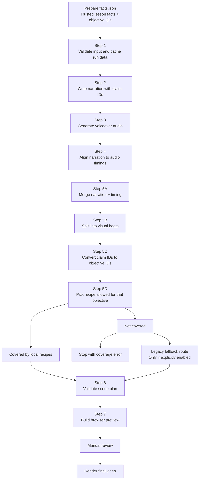

# Scene Generation Pipeline: Plain-English Guide

This guide explains how the current Physics V3 pipeline turns a syllabus topic
into animated scenes.

The original version of this document was written like an engineering runbook.
This version is meant to be much easier to read. It focuses on:

- what each step does;
- what files get created;
- where problems usually begin;
- how to debug the pipeline without getting lost.

## The big idea

The system does **not** normally ask an AI model to invent scene code.

Instead, it follows this rule:

```text
facts -> narration claim IDs -> syllabus objective IDs -> allowed visual recipes
```

That means a scene is chosen from a trusted list of recipes that are already tied
to the correct objective. The pipeline is designed to stay grounded in the
curriculum instead of guessing from text similarity.

If a topic does not yet have recipe coverage, the pipeline can either:

- stop and report missing coverage; or
- use the older fallback route, but only if that fallback is explicitly enabled.

## Pipeline flow



## Core rule to remember

The safest mental model is:

1. The narration says something.
2. That narration points to one or more claim IDs.
3. Claim IDs map to syllabus objective IDs.
4. Only recipes registered for those objectives are allowed.
5. The best matching recipe is chosen from that allowed set.

So if a scene is wrong, the problem usually started earlier than the visual layer.

## Main files and what they do

| File | Plain-English purpose |
|---|---|
| `video_engine/topics/<topic>/facts.json` | Trusted input facts for the lesson |
| `template_lab/scripts/mav_generate.py` | Main pipeline runner |
| `template_lab/scripts/mav_plan_v3.py` | Breaks narration into scene beats and plans scenes |
| `template_lab/scripts/mav_recipes.py` | Chooses the correct recipe deterministically |
| `template_lab/assets/objective_visual_recipes.json` | Recipe registry tied to syllabus objectives |
| `physics_animation_engine/engine/scene_recipe.js` | Turns typed recipes into browser scenes |
| `physics_animation_engine/styles/modules/recipe.css` | Shared styling for recipe scenes |
| `template_lab/scripts/mav_validate_v3.py` | Validates structure and safety |
| `template_lab/scripts/mav_build_preview_v3.py` | Builds preview HTML for the whole lesson |
| `template_lab/scripts/mav_preview.py` | Local preview server |
| `template_lab/scripts/mav_render.py` | Final frame rendering and video export |

## Where each run is stored

Every run goes here:

```text
template_lab/runs/<run-id>/
```

The output files usually appear in this order:

```text
input.json
story_skeleton.json
narration.json
voiceover.mp3
audio_timing.json
audio_word_timestamps.json
objective_recipe_coverage.json
scene_routes.json
scene_plan_v3.json
v3_scenes/scene_XX.json
validation/plan_validation_v3.json
compositions/master_v3.html
preview_manifest_v3.json
renders/master_v3.mp4
```

When debugging, do **not** start with the MP4 unless you have to. Start at the
earliest file that looks wrong. That is usually where the real issue began.

## Step-by-step explanation

## Step 0: Prepare the topic facts

Command:

```bash
python3 -m video_engine.cli prepare-topic 1.1
```

This creates:

```text
video_engine/topics/1.1/facts.json
```

This file contains the trusted lesson data:

- the topic reference;
- the syllabus objective IDs;
- the factual teaching claims;
- the intended narrative mode.

Why this matters:

If this file is incomplete or wrong, every later decision becomes weaker. If the
pipeline chooses bad visuals because the objective list is wrong, the fix belongs
here, not in the scene renderer.

## Step 1: Validate and cache the input

The pipeline stores the cleaned run input in:

```text
template_lab/runs/<run-id>/input.json
```

What happens here:

- `topic_ref` is preserved;
- duplicate objective IDs are removed;
- the run is stored in a stable format for the later steps.

Useful check:

```bash
jq '{run_id, topic_ref, objective_ids, fact_count: (.facts | length)}' \
  template_lab/runs/<run-id>/input.json
```

What to look for:

Make sure the correct objective IDs are already present before narration or visual
planning begins.

## Step 2: Create the narration

This produces:

```text
template_lab/runs/<run-id>/narration.json
```

Each paragraph in the narration includes:

- an ID like `paragraph_04`;
- a `beat_label` like `mechanism` or `worked_example`;
- the spoken text;
- `claim_ids` linking the paragraph back to trusted facts.

Useful check:

```bash
jq '.paragraphs[] | {id, beat_label, claim_ids, text}' \
  template_lab/runs/<run-id>/narration.json
```

Why this matters:

The pipeline should not guess scene meaning only from the words in the paragraph.
It relies on `claim_ids` to stay grounded.

Common failure here:

If a normal teaching paragraph loses its claim IDs, later scene selection becomes
less specific and more error-prone.

## Step 3: Generate the voiceover

This creates:

```text
voiceover.mp3
audio_generation.json
```

Why this matters:

The speed of the voice affects scene pacing. Even a correct recipe can feel too
slow or too fast if the final audio duration changes a lot.

Useful check:

```bash
ffprobe -v error -show_entries format=duration -of default=nw=1:nk=1 \
  template_lab/runs/<run-id>/voiceover.mp3
```

## Step 4: Align narration to audio

This creates:

```text
audio_timing.json
audio_word_timestamps.json
```

What this step does:

- gives each paragraph a start and end time;
- records word-level timestamps;
- lets scene changes line up more closely with the spoken phrases.

Useful check:

```bash
jq '.paragraphs[] | {id, start, end, duration, whisper_match_score}' \
  template_lab/runs/<run-id>/audio_timing.json
```

Common failure here:

If timing is bad, a scene may appear too early, stay too long, or switch at an
awkward phrase even when the scene content itself is correct.

## Step 5A: Merge narration and timing

This happens inside:

```text
mav_plan_v3.py::_merge_narration_timing()
```

What it does:

It combines the narration text, beat labels, claim IDs, and exact timing into one
internal structure used by scene planning.

Important detail:

Claim IDs must survive this merge. If they are lost here, the visual layer becomes
ungrounded even if `narration.json` was fine.

## Step 5B: Split narration into visual beats

This happens inside:

```text
mav_plan_v3.py::_split_visual_beats()
```

Default timing limits:

```text
MAV_V3_MIN_SHOT_SECONDS=5
MAV_V3_TARGET_SHOT_SECONDS=11
MAV_V3_MAX_SHOT_SECONDS=15
```

What this step does:

1. Breaks paragraphs at meaningful punctuation.
2. Maps those text chunks to word timings.
3. Splits chunks that are too long.
4. Merges chunks that are too short when it still makes sense.
5. Copies the original paragraph's `beat_label` and `claim_ids` into each beat.

Why this matters:

Each visual beat becomes a scene group. This helps keep unrelated ideas from
sharing one scene, but it can also increase repetition if one paragraph is split
into several beats and only one strong recipe exists for that objective.

Common reason videos feel repetitive:

- the paragraph was over-split;
- only one recipe variant exists for that objective;
- the variants are too similar;
- the beat labels are too broad.

Good fixes:

- add more recipe variants for the same objective;
- make recipe metadata more specific;
- tune shot duration rules;
- avoid immediate recipe repetition when another valid option exists.

## Step 5C: Convert claim IDs to objective IDs

This happens inside:

```text
mav_plan_v3.py::_objective_id_from_claim_id()
```

What it does:

It turns recognized claim IDs into the canonical objective IDs used for recipe
selection.

Important detail:

Unknown fact IDs stay as metadata, but they do not automatically become objective
IDs.

## Step 5D: Choose a recipe

This happens inside:

```text
mav_recipes.py::select_recipe()
```

What the selector does:

1. Cleans and de-duplicates the objective IDs.
2. Loads and validates the recipe registry.
3. Throws away any recipe not allowed for those objectives.
4. Scores the remaining recipes using:
   - beat label match;
   - partial beat label match;
   - cue-term matches from the narration text.
5. Breaks ties deterministically.
6. Rotates tied variants to reduce repetition.
7. Copies the selected recipe into the scene artifact.

The recipe registry is:

```text
template_lab/assets/objective_visual_recipes.json
```

This is the heart of the model-free design. The system is not improvising scene
code. It is selecting from structured, pre-authored recipes.

## What a recipe is

A recipe is structured data, not raw HTML or generated JavaScript.

It usually defines:

- which objective it belongs to;
- which beat labels it supports;
- useful cue terms;
- the workbench or visual family;
- the visual nodes to draw;
- the actions to animate.

Why that matters:

Because recipes are data, they are safer, easier to validate, easier to reuse, and
less likely to drift away from the curriculum.

## Reusable visual vocabulary

The pipeline uses shared visual families called workbenches, such as:

1. Measurement and apparatus
2. Mechanics, forces and vectors
3. Materials and fluids
4. Energy and system flow
5. Matter and thermal physics
6. Waves, optics and signals
7. Fields, charge and magnetism
8. Circuits and electrical systems
9. Electromagnetic devices
10. Atomic and nuclear physics
11. Space, scale and timelines

The general rule is:

If a new concept needs a new visual primitive, add it once in the shared renderer
and reuse it across many recipes. Do not build one-off code for every objective.

## Step 5E: Write planning artifacts

This step creates:

```text
objective_recipe_coverage.json
scene_routes.json
scene_plan_v3.json
v3_scenes/scene_XX.json
```

Useful checks:

```bash
jq '{scene_count, covered_scene_count, uncovered_scene_count, uncovered_scene_ids}' \
  template_lab/runs/<run-id>/objective_recipe_coverage.json
```

```bash
jq '.routing_summary' template_lab/runs/<run-id>/scene_plan_v3.json
```

What you want in a fully local recipe run:

- all scenes covered;
- zero uncovered scenes;
- routing summary shows `recipe` for everything;
- `module` and `custom` stay at zero.

## What happens when recipe coverage is missing

If a beat has no valid local recipe:

- with fallback disabled, the run stops and reports the uncovered scene IDs;
- with fallback enabled, only those uncovered beats go through the old path.

The old path is slower and more expensive because it may need large model calls to
plan or code a scene.

If a run feels stuck during Step 5, it may actually be slowly processing fallback
scenes rather than being frozen.

## Step 6: Validate the plan

This happens in:

```text
mav_validate_v3.py::validate_v3_plan()
```

This creates:

```text
validation/plan_validation_v3.json
```

What validation checks:

- recipe structure;
- unique node IDs;
- geometry within the normalized scene space;
- action targets that actually exist;
- action timing that stays inside the scene;
- forbidden constructs in legacy fallback code.

What validation does **not** check:

- whether the scene is exciting;
- whether it is the best teaching visual;
- whether the animation feels polished;
- whether the pedagogy is ideal.

Those still require human review.

## Step 7: Build the browser preview

Main files involved:

```text
mav_build_preview_v3.py
physics_animation_engine/engine/scene_recipe.js
physics_animation_engine/styles/modules/recipe.css
```

This step:

1. Creates browser scene containers.
2. Inserts validated recipe data and timing.
3. Builds safe DOM and SVG nodes.
4. Builds GSAP timelines for each scene.
5. Places those timelines onto one lesson-wide master timeline.

Outputs:

```text
compositions/master_v3.html
compositions/scenes_v3/scene_XX.html
preview_manifest_v3.json
```

## Why a scene can still feel boring even if it is valid

Validation only proves the scene is structurally acceptable. It does not prove the
scene is good.

Here is the simplest way to debug boring visuals:

| Symptom | First place to inspect | Likely cause | Best fix |
|---|---|---|---|
| Same visual repeats | `scene_routes.json` | Too few recipe variants or over-segmentation | Add valid variants or tune beat length |
| Scene becomes static almost immediately | `v3_scenes/scene_XX.json` | All actions happen at the start | Spread meaningful actions across the scene |
| Motion feels decorative | Recipe actions vs narration | Animation does not express the spoken idea | Use actions that construct, compare, measure, reveal, or trace meaningfully |
| Topic is correct but the explanation style is wrong | Recipe metadata | Beat labels or cue terms are too broad | Make recipe metadata more specific |
| Scene is unrelated | `claim_ids` and objective mapping | Grounding was lost earlier | Fix upstream grounding |
| Scene changes at the wrong phrase | Timing files | Alignment or beat splitting issue | Fix timing or segmentation |
| Diagram looks tiny or stretched | Node geometry or renderer | Bad normalized layout or primitive behavior | Fix geometry or shared primitive |
| Whole lesson feels low-energy | Recipe set | Too many reveal-only recipes | Author richer state changes |
| Step 5 is very slow | Coverage and model usage files | Uncovered beats entered fallback | Add recipes or accept fallback cost |
| Browser scene breaks completely | Validation report or console | Runtime/compiler error | Fix compiler and add regression coverage |

Most important visual rule:

**Motion should carry meaning.**

A moving object should teach something. Decorative movement by itself usually does
not fix a weak scene.

## How to check a slow or stuck Step 5

Set the run ID:

```bash
RUN=physics-1-1-v01
```

Check how many scene files exist:

```bash
find "template_lab/runs/$RUN/v3_scenes" -name 'scene_*.json' | wc -l
```

Check the planned scene count:

```bash
jq '.scene_count' "template_lab/runs/$RUN/scene_plan_v3.json"
```

Check local recipe coverage:

```bash
jq '{covered_scene_count, uncovered_scene_count, uncovered_scene_ids}' \
  "template_lab/runs/$RUN/objective_recipe_coverage.json"
```

Check model usage:

```bash
jq '.' "template_lab/runs/$RUN/costs/model_usage.json"
```

How to interpret that:

- If coverage is complete and nothing moves for minutes, inspect the local process
  or recent errors.
- If uncovered scenes exist and model usage is increasing, the run is on the slow
  fallback path.
- If scene files keep appearing one by one, the run is working, just sequentially.
- If no scene plan exists, look for the earlier failure before Step 5.
- If Step 5 is done but preview is slow, the issue is in Step 7, not selection.

## Manual preview workflow

Start the preview server:

```bash
python3 template_lab/scripts/mav_preview.py --run-id "$RUN" --port 8766
```

Open:

```text
http://127.0.0.1:8766/runs/<run-id>/compositions/master_v3.html
```

When reviewing, check:

1. the first frame of each scene;
2. the middle of each important construction or comparison;
3. the final hold before fade;
4. whether scene boundaries match spoken phrases;
5. units, labels, directions, apparatus readings, and graph markings;
6. repeated recipe IDs in nearby scenes;
7. browser console errors or warnings.

Do not approve the lesson from thumbnails alone. Many scene problems only show up
when you scrub or play at normal speed.

## How to add a new reusable recipe

Use this process:

1. Pick the correct objective ID from
   `video_engine/curriculum/objectives.json`.
2. Decide what teaching job the scene is doing:
   definition, mechanism, comparison, experiment, graph reading, prediction,
   worked example, or synthesis.
3. Choose the closest workbench.
4. Reuse existing node and action types where possible.
5. If something is missing, add it once in `scene_recipe.js` and style it in
   `recipe.css`.
6. Add the recipe entry to `objective_visual_recipes.json`.
7. Use precise beat labels and cue terms.
8. Add alternate variants if that objective will likely appear in multiple nearby
   beats.
9. Run tests and validation.
10. Generate a smoke run and inspect it manually.

## Rebuild only the scene-planning part

If script, audio, and timing are already cached, you can regenerate from Step 5:

```bash
python3 template_lab/scripts/mav_generate.py \
  --run-id "$RUN" \
  --facts video_engine/topics/1.1/facts.json \
  --duration 480 \
  --v3 \
  --from-step 5 \
  --stop-after-step 7
```

If local coverage is incomplete, this stops clearly with a coverage error instead
of silently picking a vague generic visual.

To rebuild from already-written scenes:

```bash
python3 template_lab/scripts/mav_generate.py \
  --run-id "$RUN" \
  --facts video_engine/topics/1.1/facts.json \
  --duration 480 \
  --v3 \
  --from-step 6
```

## Tests and verification

Run Template Lab tests:

```bash
.venv/bin/python -m unittest discover -s template_lab/tests -p 'test_*.py'
```

Run curriculum and registry tests:

```bash
.venv/bin/python -m unittest discover -s video_engine/tests -p 'test_*.py'
```

Check browser compiler syntax:

```bash
node --check physics_animation_engine/engine/scene_recipe.js
```

Validate every recipe with the browser-side validator:

```bash
node --input-type=module - <<'JS'
import fs from 'node:fs';
import {validateRecipe} from './physics_animation_engine/engine/scene_recipe.js';
const registry = JSON.parse(
  fs.readFileSync('./template_lab/assets/objective_visual_recipes.json', 'utf8')
);
for (const entry of registry.recipes) validateRecipe(entry.recipe);
console.log(`validated ${registry.recipes.length} recipes`);
JS
```

## Current reference run

The known local smoke run is:

```text
template_lab/runs/physics-1-1-recipe-smoke
```

At the time this document was written, it shows:

- 41 narration-aligned scenes;
- 41 recipe routes;
- 0 module routes;
- 0 custom/model-coded routes;
- 0 uncovered beats;
- 0 validation violations;
- no browser console errors in representative checks.

That proves the model-free recipe path works for Topic `1.1`.

It does **not** mean the entire syllabus is fully covered yet. The long-term plan
is to keep expanding recipe coverage objective by objective while keeping the
renderer small, reusable, and well tested.

## Short version

If you only want the simplest summary, here it is:

1. Start with trusted lesson facts.
2. Create narration tied to claim IDs.
3. Align narration to audio.
4. Split narration into scene-sized beats.
5. Convert those beats into objective IDs.
6. Pick only recipes allowed for those objectives.
7. Validate the plan.
8. Build the browser preview.
9. Review it manually.
10. Render the final video.

If something looks wrong, trace backward until you find the **first** bad file.
That is usually where the real bug started.
