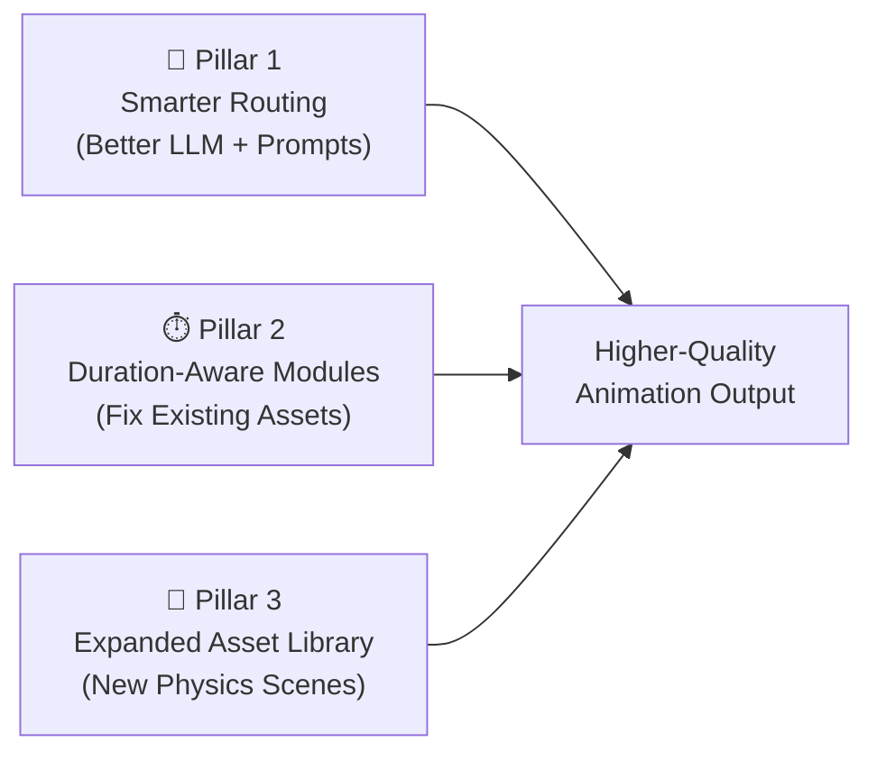

# Animation Quality Upgrade — Implementation Plan

> Implementation note (2026-07-14): the approved version keeps the three-pillar
> direction but replaces hard routing quotas with semantic visual-beat routing,
> uses narration cue points instead of percentage-based pacing, and removes the
> proposed automated subjective QA gate. Generic camera drift is also excluded;
> motion must communicate physics or a change of focus. The first six syllabus-
> driven modules are now implemented, bringing the registry to 41 scenes.

Your suggestions are exactly right. There are three separate but reinforcing improvements, and all three are needed together. Here's the detailed plan.

---

## Overview: The Three Pillars



| Pillar                    | What                                                            | Effort    | Impact     |
| ------------------------- | --------------------------------------------------------------- | --------- | ---------- |
| 1. Smarter Routing        | Upgrade router + parameterizer to Gemini Flash 3.5, fix prompts | ~2 hours  | 🔴 Critical |
| 2. Duration-Aware Modules | Make all 35 modules fill their scene duration with motion       | ~4 hours  | 🔴 Critical |
| 3. Expanded Asset Library | Add 15–20 new syllabus-driven scenes                            | ~12 hours | 🟡 High     |

---

## Pillar 1: Smarter Routing — Better LLM + Better Prompts

### Current State (The Problem)

```
scene_asset_shortlister  →  gemini-3.1-flash-lite  ❌ Too cheap/dumb for visual reasoning
scene_asset_router       →  gemini-3.1-flash-lite  ❌ Same — makes lazy keyword matches
module_parameterizer     →  gemini-3.1-flash-lite  ❌ Fills params mechanically, no creativity
```

Flash Lite is a fast/cheap model optimized for simple classification. But routing requires **visual imagination** — the model must reason about "what a learner needs to *see* while hearing this narration." Flash Lite doesn't have the reasoning depth for that.

### Step 1.1: Upgrade Model Assignments

**File:** [prompt_model_mapping.json](file:///Users/ananthu/Downloads/papacambridge_physics_0625_downloader/template_lab/prompts/prompt_model_mapping.json)

| Task                      | Current                 | Recommended            | Rationale                                                                         |
| ------------------------- | ----------------------- | ---------------------- | --------------------------------------------------------------------------------- |
| `scene_asset_shortlister` | `gemini-3.1-flash-lite` | `gemini-3.5-flash`     | Needs semantic understanding of lesson vs module capabilities                     |
| `scene_asset_router`      | `gemini-3.1-flash-lite` | **`gemini-3.5-flash`** | **This is the critical decision**. Needs visual imagination, not keyword matching |
| `module_parameterizer`    | `gemini-3.1-flash-lite` | `gemini-3.5-flash`     | Needs to maximize module expressiveness with creative parameter choices           |
| `v3_creative_director`    | `glm-5.2` (Z.AI)        | Keep as-is ✅           | Already good — scene_03 proves this                                               |
| `v3_scene_coder`          | `kimi-k2.7-code`        | Keep as-is ✅           | Already good — produces working GSAP                                              |

> [!TIP]
> The shortlister and router are **cheap calls** (4K–12K tokens output). Upgrading from flash-lite to flash-3.5 adds negligible cost (~$0.01–0.03 per run) but dramatically improves visual reasoning.

### Step 1.2: Strengthen the Router Prompt

**File:** [scene_asset_router.system.txt](file:///Users/ananthu/Downloads/papacambridge_physics_0625_downloader/template_lab/prompts/scene_asset_router.system.txt)

**Current problems:**
- Rule 3 says "Prefer a registered module when it can communicate the central physics accurately" — this over-encourages module routing
- No rule about visual variety or animation richness
- No penalty for text-heavy modules when narration describes spatial/physical processes
- No deduplication constraint

**Proposed new prompt:**

```text
You are the lesson-level asset-routing teacher for an IGCSE Physics animation engine.

You receive the complete narration split into timed scene groups and detailed cards for a lesson-level shortlist of registered deterministic scene modules. Choose the most educational rendering route for every scene group.

Rules:
1. Return exactly one route for every supplied scene_id.
2. route must be "module" or "custom".
3. A registered module is appropriate ONLY when it communicates the central physics
   more clearly than bespoke animation could. Simple text displays
   (DefinitionCard, ComparisonTable, NumericalExample, SummaryCard, TitleCard)
   are appropriate only for genuinely definitional, tabular, or bookend content.
4. Select custom when:
   - The narration describes a physical process, apparatus, measurement technique,
     or spatial relationship (these always benefit from bespoke diagrams).
   - The module would show text that merely restates the narration.
   - The module's built-in animation finishes in seconds but the scene lasts
     30+ seconds (the viewer would see a long static hold).
   - The same module is already assigned to another scene in this lesson.
5. Do not match by keywords. Judge what a learner must SEE while hearing the narration.
   A narration about "pendulum oscillation timing" needs swinging motion, not bullet points.
6. VARIETY: No single module may appear more than twice in one lesson. If a module
   is already assigned to 2 scenes, you MUST route the next candidate to custom.
7. BALANCE: At least 40% of scenes should be custom in a typical lesson. Text-card
   modules (DefinitionCard, ComparisonTable, NumericalExample, SummaryCard)
   should together account for no more than 3 scenes.
8. Never invent module names. A module route must use a scene name from SHORTLISTED MODULES.
9. Give two alternatives where possible, using only registered module names.
10. confidence is a number from 0 to 1. It expresses routing certainty, not scientific certainty.
11. For custom routes, explain why no available module is adequate.
12. Treat force direction, vector magnitude, graph axes, circuit topology, ray geometry, apparatus and units as factual.
13. Output strict JSON only.

Output shape:
{
  "routes": [
    {
      "scene_id": "scene_01",
      "route": "module",
      "module": "Scene_TitleCard",
      "alternatives": ["Scene_DefinitionCard"],
      "reason": "Short teaching reason.",
      "confidence": 0.95,
      "parameter_guidance": "What the module should display and reveal."
    }
  ]
}
```

### Step 1.3: Strengthen the Parameterizer Prompt

**File:** [module_parameterizer.system.txt](file:///Users/ananthu/Downloads/papacambridge_physics_0625_downloader/template_lab/prompts/module_parameterizer.system.txt)

**Add to existing rules:**

```text
8. Include the scene duration in params as "duration" when the schema accepts it.
   The module uses this to pace its animation across the full narration.
9. Maximize visual content density: prefer numerical values, units, specific labels,
   and physics-meaningful content over generic descriptions.
10. If the module has optional visual parameters (colors, showNetForce, showAcceleration),
    enable them to maximize visual interest.
```

### Step 1.4: Add Post-Routing Validation in Pipeline Code

**File:** [mav_plan_v3.py](file:///Users/ananthu/Downloads/papacambridge_physics_0625_downloader/template_lab/scripts/mav_plan_v3.py)

Add a programmatic check after routing but before scene generation:

```python
def _validate_routing_diversity(route_plan: dict, scene_count: int) -> list[str]:
    """Enforce routing diversity constraints."""
    warnings = []
    routes = route_plan.get("routes", [])
    
    # Count module usage
    module_counts = {}
    text_card_modules = {"Scene_DefinitionCard", "Scene_ComparisonTable", 
                         "Scene_NumericalExample", "Scene_SummaryCard", "Scene_TitleCard"}
    text_card_count = 0
    custom_count = 0
    
    for route in routes:
        if route["route"] == "custom":
            custom_count += 1
        elif route["route"] == "module":
            module = route.get("module", "")
            module_counts[module] = module_counts.get(module, 0) + 1
            if module in text_card_modules:
                text_card_count += 1
    
    # Check: no module used more than twice
    for module, count in module_counts.items():
        if count > 2:
            warnings.append(f"Module {module} used {count} times (max 2)")
    
    # Check: minimum 40% custom
    if scene_count > 3 and custom_count < scene_count * 0.4:
        warnings.append(f"Only {custom_count}/{scene_count} custom scenes (target: ≥40%)")
    
    # Check: text-card cap
    if text_card_count > 3:
        warnings.append(f"{text_card_count} text-card modules used (max 3)")
    
    return warnings
```

---

## Pillar 2: Duration-Aware Module Timelines

### Current State (The Problem)

Every module has a hard-coded ~3–6 second animation that completes immediately, then holds static for the remaining 40–50 seconds. The `duration` parameter is passed to `buildTimeline()` but most modules ignore it.

### Step 2.1: Fix the Phase 3 Shared Helper

**File:** [_shared.js](file:///Users/ananthu/Downloads/papacambridge_physics_0625_downloader/template_lab/project/module_runtime/modules/phase3/_shared.js)

Add a duration-aware timeline helper:

```javascript
export function phase3Pacing(params, fallback = 6) {
  const total = duration(params, fallback);
  return {
    total,
    headerIn:     0.08,              // header starts
    contentIn:    total * 0.06,       // main content starts  
    staggerGap:   total * 0.12,      // gap between staggered items
    highlightAt:  total * 0.55,      // mid-scene emphasis moment
    holdEnd:      total * 0.92,      // start dimming for exit
  };
}
```

### Step 2.2: Fix Scene_NumericalExample (Used 3× in this run)

**File:** [Scene_NumericalExample.js](file:///Users/ananthu/Downloads/papacambridge_physics_0625_downloader/template_lab/project/module_runtime/modules/phase3/Scene_NumericalExample.js)

**Current:** All steps pile up in ~3 seconds:
```javascript
const at = .8 + index * .78;  // all steps done by ~3.5s
```

**Fix:** Spread reveals across the full scene duration:
```javascript
buildTimeline(params) {
    const tl = phase3Timeline(this.root);
    const dur = duration(params, Math.max(6, 2.2 + this.steps.length * .8));
    const stepInterval = (dur * 0.65) / this.steps.length;
    const startOffset = dur * 0.08;

    tl.fromTo(this.panel, { y: 28, autoAlpha: 0 }, { y: 0, autoAlpha: 1, duration: .55 }, .3)
      .fromTo(this.progress, { x: 30, autoAlpha: 0 }, { x: 0, autoAlpha: 1, duration: .45 }, .55);

    this.steps.forEach((step, index) => {
      const at = startOffset + index * stepInterval;
      tl.fromTo(step, { x: -40, autoAlpha: 0 }, { x: 0, autoAlpha: 1, duration: .6, ease: 'power2.out' }, at)
        .to(step, { borderColor: 'rgba(255,210,63,.52)', backgroundColor: 'rgba(255,210,63,.065)', duration: .35 }, at + .25);
      if (index) tl.to(this.steps[index - 1], { opacity: .48, borderColor: 'rgba(255,255,255,.07)', duration: .35 }, at + .25);
      tl.to(this.progress.querySelector('span'), { width: `${(index + 1) / this.steps.length * 100}%`, duration: .55 }, at + .2);
    });

    // Add subtle camera drift across the full scene
    tl.to(this.root, { scale: 1.012, duration: dur * 0.9, ease: 'none' }, 0);

    return finishPhase3(tl, this.root, params, dur);
}
```

### Step 2.3: Apply Same Pattern to All Phase3 Modules

Same timing fix needed for:
- `Scene_ComparisonTable` — stagger row reveals across 60% of duration
- `Scene_DefinitionCard` — reveal term → pause → definition → pause → example
- `Scene_MathEquation` — equation reveal at 20%, highlight pulse at 50%, caption at 70%

### Step 2.4: Add Camera Drift to Module Scene Wrapper

**File:** [master_v3.html](file:///Users/ananthu/Downloads/papacambridge_physics_0625_downloader/template_lab/scripts/mav_build_preview_v3.py) (the preview builder)

For every module scene, inject a subtle camera drift in the composition timeline:

```javascript
// After adding the module timeline:
const camera = document.querySelector(`[data-scene-id="${sceneId}"] .camera`);
if (camera) {
  tl.to(camera, { scale: 1.015, duration: dur, ease: 'none' }, start);
}
```

This ensures every scene has at least slow camera movement, even if the module animation is static.

---

## Pillar 3: Expanded Asset Library — Syllabus-Driven New Scenes

### Current Coverage Gap

Here's the full IGCSE 0625 syllabus mapped against current asset coverage:

| Syllabus Section               | Topics  | Current Modules                                                                                                            | Gap                                                                                            |
| ------------------------------ | ------- | -------------------------------------------------------------------------------------------------------------------------- | ---------------------------------------------------------------------------------------------- |
| **1. General Physics**         | 1.1–1.8 | ForceDiagram, CollisionBlocks, ProjectileMotion, CircularMotion, SpringMass, InclinedPlane, NumericalExample, GraphPlotter | ⚠️ Missing: **MeasuringInstrument**, **VelocityTimeGraph**, **PressureDemo**, **MomentBalance** |
| **2. Thermal Physics**         | 2.1–2.3 | ParticleModel, ThermalHeating, GasParticles                                                                                | ⚠️ Missing: **ThermalConduction**, **ConvectionCurrent**, **ThermalExpansion**                  |
| **3. Waves**                   | 3.1–3.4 | WaveForm, WaveBehavior, EMSpectrum, StandingWave, RayDiagram                                                               | ⚠️ Missing: **SoundWave**, **TotalInternalReflection**                                          |
| **4. Electricity & Magnetism** | 4.1–4.5 | CircuitDiagram, ElectronFlow, MagneticField, MotorEffect, EMInduction, Transformer                                         | ⚠️ Missing: **VoltageCurrentGraph**, **SeriesParallel**, **ACGenerator**, **DCMotor**           |
| **5. Nuclear**                 | 5.1–5.2 | AtomicModel, NuclearDecay, NuclearReaction, RadiationPenetration                                                           | ✅ Well covered                                                                                 |
| **6. Space**                   | 6.1–6.2 | OrbitalMotion, StarLifeCycle                                                                                               | ⚠️ Missing: **SolarSystem**                                                                     |

### Proposed New Modules — Priority Order

#### Priority 1: Scenes needed for the FIRST 8 topics (most immediate production value)

| #   | Scene Name                  | Category    | Covers Topics | Visual Description                                                                                     |
| --- | --------------------------- | ----------- | ------------- | ------------------------------------------------------------------------------------------------------ |
| 1   | `Scene_MeasuringInstrument` | measurement | 1.1           | Animated ruler, micrometer, or measuring cylinder with reading line, meniscus, and parallax indicators |
| 2   | `Scene_VelocityTimeGraph`   | graphs      | 1.2           | Specialized v-t graph with colored area under curve for displacement, gradient for acceleration        |
| 3   | `Scene_MomentBalance`       | mechanics   | 1.5.2, 1.5.3  | Pivot beam with weight arrows, moment arms, and distance markers showing clockwise = anticlockwise     |
| 4   | `Scene_PressureDemo`        | mechanics   | 1.8           | Force arrows on surfaces of different area, F/A calculation, hydraulic press visualization             |
| 5   | `Scene_DensityExperiment`   | measurement | 1.4           | Object on balance + measuring cylinder, mass/volume calculation, floating/sinking comparison           |
| 6   | `Scene_SeriesParallel`      | electricity | 4.3.2         | Side-by-side series vs parallel circuit with animated current flow and voltage division                |

#### Priority 2: Scenes needed for topics 9–30

| #   | Scene Name                      | Category         | Covers Topics | Visual Description                                                                         |
| --- | ------------------------------- | ---------------- | ------------- | ------------------------------------------------------------------------------------------ |
| 7   | `Scene_ConvectionCurrent`       | thermal          | 2.3.2         | Animated particle loop showing hot rise, cool sink, with temperature gradient              |
| 8   | `Scene_ThermalExpansion`        | thermal          | 2.2.1         | Bar/ring expanding with temperature, particle spacing increasing, bimetallic strip curving |
| 9   | `Scene_TotalInternalReflection` | optics           | 3.2.2         | Ray hitting boundary at increasing angles, critical angle, fiber optic application         |
| 10  | `Scene_SoundWave`               | waves            | 3.4           | Compression/rarefaction visualization, frequency/amplitude controls, speed comparison      |
| 11  | `Scene_ACGenerator`             | electromagnetism | 4.5.2         | Rotating coil in magnetic field, linked sine wave output, slip rings                       |
| 12  | `Scene_DCMotor`                 | electromagnetism | 4.5.5         | Coil rotation in field, commutator split ring, force on sides                              |
| 13  | `Scene_VoltageCurrentGraph`     | electricity      | 4.2.4         | V-I characteristic curves for ohmic conductors, filament lamp, diode                       |

#### Priority 3: Filling remaining gaps

| #   | Scene Name                | Category    | Covers Topics |
| --- | ------------------------- | ----------- | ------------- |
| 14  | `Scene_ThermalConduction` | thermal     | 2.3.1         |
| 15  | `Scene_SolarSystem`       | space       | 6.1.2         |
| 16  | `Scene_EarthLayers`       | space       | 6.1.1         |
| 17  | `Scene_HalfLifeGraph`     | nuclear     | 5.2.4         |
| 18  | `Scene_ElectricField`     | electricity | 4.2.1         |

### Module Development Template

Each new module follows the existing pattern in `phase3/`:

```javascript
import { append, el, finishPhase3, phase3Root, phase3Timeline, schemas, duration } from './_shared.js';

export class Scene_MeasuringInstrument {
  setup(container, params) {
    const frame = phase3Root(container, 'Scene_MeasuringInstrument', 
      'Reading instruments', params.title, 
      'Accurate measurement requires correct technique.', 
      'scene-measuring-instrument');
    this.root = frame.root;
    // Build SVG instrument, scale markings, reading line, parallax indicators
  }
  
  buildTimeline(params) {
    const dur = duration(params, 8);
    const tl = phase3Timeline(this.root);
    // Duration-aware animation spread across `dur`:
    // 0-15%: instrument appears
    // 15-40%: scale markings draw on
    // 40-65%: reading line moves to measurement point
    // 65-85%: labels and value appear
    // 85-100%: subtle camera drift + hold
    return finishPhase3(tl, this.root, params, dur);
  }
  
  teardown() { this.root?.remove(); }
  
  static getParamSchema() {
    return {
      type: 'object',
      required: ['instrument', 'reading'],
      additionalProperties: false,
      properties: {
        title: schemas.shortText('Measurement', 60),
        instrument: { type: 'string', enum: ['ruler', 'micrometer', 'cylinder', 'thermometer', 'balance'], default: 'ruler' },
        reading: schemas.positive(25.0, 1000),
        unit: schemas.shortText('cm', 10),
        showParallax: schemas.toggle(false),
        showMeniscus: schemas.toggle(false),
      }
    };
  }
}
```

Each module needs:
1. **JS class** (~80–150 lines) in `template_lab/project/module_runtime/modules/phase3/`
2. **CSS** in `template_lab/project/module_runtime/styles/modules/phase3.css`
3. **Registry entry** in `video_engine/registry/animation_assets.json`
4. **Import + export** in `template_lab/project/module_runtime/modules/_registry.js`

---

## Implementation Order

### Week 1: Quick Wins (Pillar 1 + 2)

```
Day 1–2:  Upgrade model mapping → gemini-3.5-flash for router/parameterizer
          Rewrite router + parameterizer prompts
          Add post-routing diversity validation
          
Day 3–4:  Fix duration-aware timelines in all Phase3 modules
          Add camera drift to module scene wrapper
          Test with physics-1-1 re-run
```

### Week 2–3: New Assets (Pillar 3 Priority 1)

```
Day 5–6:   Scene_MeasuringInstrument + Scene_DensityExperiment
Day 7–8:   Scene_VelocityTimeGraph + Scene_MomentBalance  
Day 9–10:  Scene_PressureDemo + Scene_SeriesParallel
```

### Week 4+: Remaining Assets (Pillar 3 Priority 2–3)

Build 2 modules per day in priority order, testing each with a pilot lesson.

---

## Verification: Re-Running physics-1-1 After Pillar 1+2

After applying Pillar 1 and 2 changes, re-run with:

```bash
RUN_ID=physics-1-1-v02

python3 template_lab/scripts/mav_generate.py \
  --run-id "$RUN_ID" \
  --facts video_engine/topics/1.1/facts.json \
  --duration 480 \
  --v3 \
  --use-gemini \
  --use-gemini-tts \
  --confirm-paid-api
```

**Expected improvement:**
- Router should assign 3–4 custom scenes (vs 1 currently)
- NumericalExample should appear max 1–2 times (vs 3)
- Module animations should fill 60–70% of their scene duration (vs ~6%)
- Camera drift on every scene eliminates static dead zones

> [!IMPORTANT]
> Don't re-run with `--from-step 6` — you need the router (Step 5) to re-execute with the new model and prompts. Script and audio from v01 can be reused by passing the same facts file.

---

## Cost Impact

| Change                        | Cost Delta Per Run                                 |
| ----------------------------- | -------------------------------------------------- |
| Router upgrade to flash-3.5   | +$0.01–0.03                                        |
| Parameterizer upgrade         | +$0.01–0.02                                        |
| More custom scenes (3–4 vs 1) | +$0.15–0.30 (more Creative Director + Coder calls) |
| **Total**                     | **~$0.20–0.35 extra per run**                      |

This is minimal compared to the quality gain. The expensive calls (Creative Director at GLM-5.2, Coder at Kimi K2.7) are already budgeted for custom scenes — you're just getting more of them.
